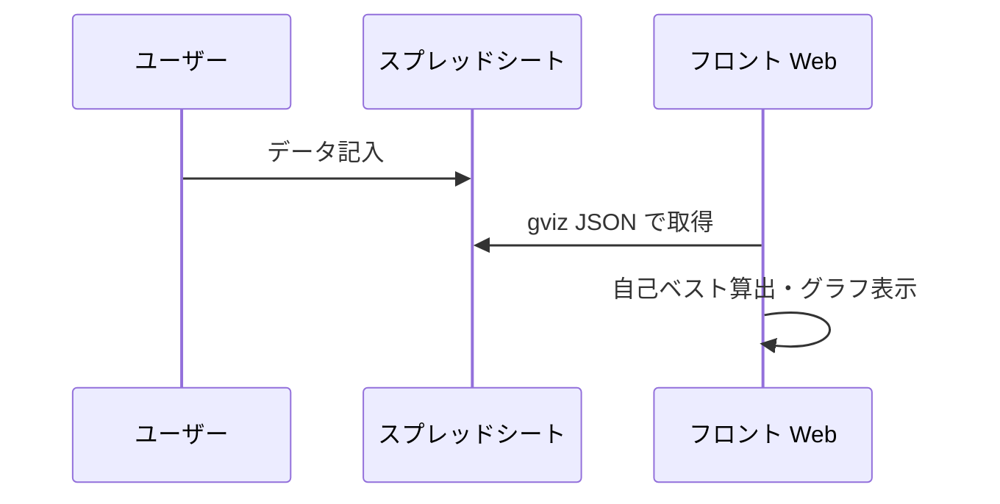

# big3-record

BIG3（ベンチプレス・スクワット・デッドリフト）の記録を Google スプレッドシートから取得し、Web でグラフ表示するアプリです。自己ベストと種目ごとの推移を折れ線グラフで確認できます。

## アーキテクチャ



- フロントは Google スプレッドシートを gviz（JSON）で取得し、React で自己ベストと折れ線グラフを表示する。
- スプレッドシートへの記録は手動入力や Google Apps Script など任意の方法で行う。

## スプレッドシート形式

| 列 | 内容 |
|---|---|
| A | 日付（タイムスタンプ） |
| B | BP（ベンチプレス）kg |
| C | SQ（スクワット）kg |
| D | DL（デッドリフト）kg |
| E | Body Weight（体重）kg |

- 1 行目はヘッダ、2 行目以降がデータ。空セルは未記録として扱う。
- 日付は UNIX 秒・ISO 文字列・`YYYY/MM/DD` 形式などに対応。

## 主な機能

- **自己ベスト表示**: BP・SQ・DL の各最大値と Total（BIG3 合計）を表示。表示日付付き。
- **折れ線グラフ**: Total（BIG3）・BP・SQ・DL・Body Weight の 5 種類を Recharts で表示。
- **補完**: グラフ描画時、BP/SQ/DL の空欄は「それ以前で最も新しい値」で補完し、Total は 3 種目から自動計算。

## 技術スタック

- React 18, Recharts, Vite, TypeScript

## ローカルで動かす

```bash
pnpm install
pnpm dev
```

## ビルド・デプロイ

```bash
pnpm build
```

- `main` ブランチへ push すると、GitHub Actions でビルドされ GitHub Pages に自動デプロイされます。
